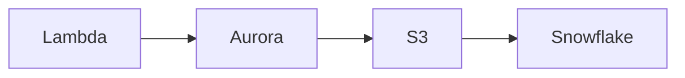

# Coding Standards

## Python Standards

### Style Guide
We follow **PEP 8** with the following tools:
- **Formatter**: `black` (88 character line length)
- **Linter**: `flake8` (max complexity: 10)

### Code Organization
```python
# 1. Standard library imports
import os
import json
from datetime import datetime

# 2. Third-party imports
import boto3
import psycopg2

# 3. Local imports
from utils import helper_function
```

### Function Documentation
All public functions must have docstrings in **Google style**:

```python
def get_snowflake_watermark(conn_params, table_name, watermark_col):
    """
    Query Snowflake to find the maximum watermark value for the table.
    
    Args:
        conn_params (dict): Snowflake connection parameters (user, password, account)
        table_name (str): Fully qualified table name (e.g., 'SCHEMA.TABLE')
        watermark_col (str): Name of the timestamp column to use as watermark
        
    Returns:
        str: Maximum timestamp value or '1970-01-01 00:00:00' if table is empty
        
    Raises:
        snowflake.connector.errors.DatabaseError: If connection or query fails
    """
    # Implementation
```

### Error Handling
- Use specific exceptions, not bare `except:`
- Always clean up resources (use context managers)
- Log errors with context

```python
# ✅ Good
try:
    conn = psycopg2.connect(**params)
    # ... work ...
except psycopg2.OperationalError as e:
    print(f"Database connection failed for {params['host']}: {e}")
    raise
finally:
    if conn:
        conn.close()

# ✅ Better (context manager)
try:
    with psycopg2.connect(**params) as conn:
        # ... work ...
except psycopg2.OperationalError as e:
    print(f"Database connection failed: {e}")
    raise

# ❌ Bad
try:
    conn = psycopg2.connect(**params)
except:
    pass  # Silent failure, no cleanup
```

### Naming Conventions
- **Variables/Functions**: `lowercase_with_underscores`
- **Constants**: `UPPERCASE_WITH_UNDERSCORES`
- **Classes**: `PascalCase`
- **Private**: `_leading_underscore`

### Type Hints (Encouraged)
```python
def calculate_batch_size(row_count: int, max_size: int) -> int:
    """Calculate optimal batch size."""
    return min(row_count, max_size)
```

## Terraform Standards

### File Organization
Organize by resource type:
```
terraform/
├── main.tf           # Provider config, module calls
├── variables.tf      # Input variables
├── outputs.tf        # Output values
├── modules/
│   ├── network/
│   │   └── vpc.tf
│   ├── compute/
│   │   └── lambda.tf
```

### Naming Conventions
- **Resources**: `resource_type_description` (e.g., `aws_s3_bucket.data_lake`)
- **Variables**: `snake_case` (e.g., `vpc_cidr`)
- **Modules**: `snake_case` (e.g., `module "compute"`)

### Variable Definitions
Always include type and description:

```hcl
variable "vpc_cidr" {
  description = "CIDR block for the VPC"
  type        = string
  default     = "10.0.0.0/16"
  
  validation {
    condition     = can(cidrhost(var.vpc_cidr, 0))
    error_message = "Must be a valid CIDR block."
  }
}
```

### Resource Tagging
All resources must include tags:

```hcl
resource "aws_s3_bucket" "data_lake" {
  bucket = "${var.project_name}-datalake"
  
  tags = {
    Name        = "${var.project_name}-datalake"
    Environment = var.environment
    ManagedBy   = "Terraform"
    Project     = var.project_name
  }
}
```

### Secrets Management
Never hardcode secrets:

```hcl
# ❌ Bad
resource "aws_db_instance" "main" {
  username = "admin"
  password = "hardcoded-password"  # Never do this!
}

# ✅ Good
data "vault_generic_secret" "db_creds" {
  path = "secret/data/db-credentials"
}

resource "aws_db_instance" "main" {
  username = data.vault_generic_secret.db_creds.data["username"]
  password = data.vault_generic_secret.db_creds.data["password"]
}
```

## SQL Standards (Snowflake)

### Keyword Casing
- **Keywords**: UPPERCASE (`SELECT`, `FROM`, `WHERE`)
- **Identifiers**: UPPERCASE for Snowflake objects, lowercase for columns (be consistent)

```sql
-- ✅ Good
SELECT 
    order_id,
    customer_id,
    order_date
FROM PUBLIC.ORDERS
WHERE order_date > '2023-01-01';

-- ❌ Inconsistent
select order_ID, CUSTOMER_id from orders where ORDER_DATE > '2023-01-01';
```

### MERGE Statements
Document complex merge logic:

```sql
-- Merge staging data into final table (SCD Type 1)
MERGE INTO PUBLIC.ORDERS AS target
USING STAGING.ORDERS AS source
ON target.order_id = source.order_id
WHEN MATCHED AND source.updated_at > target.updated_at THEN
    UPDATE SET
        target.customer_id = source.customer_id,
        target.updated_at = source.updated_at
WHEN NOT MATCHED THEN
    INSERT (order_id, customer_id, updated_at)
    VALUES (source.order_id, source.customer_id, source.updated_at);
```

## Git Standards

### Commit Messages
Follow Conventional Commits:

```
<type>(<scope>): <subject>

<body>

<footer>
```

**Types:**
- `feat`: New feature
- `fix`: Bug fix
- `docs`: Documentation only
- `style`: Code style (formatting, no logic change)
- `refactor`: Code restructuring
- `test`: Adding tests
- `chore`: Maintenance (dependencies, build)

**Examples:**
```
feat(lambda): add retry logic for Aurora exports

Implemented exponential backoff retry using tenacity library
to handle transient Aurora connection failures.

Closes #42
```

```
fix(terraform): correct S3 bucket policy for Snowflake access

The previous policy had incorrect principal ARN.
Updated to use the ARN from Snowflake Storage Integration.
```

### Branch Naming
- `feature/short-description` (e.g., `feature/add-retry-logic`)
- `fix/issue-number-description` (e.g., `fix/123-timeout-error`)
- `docs/what-changed` (e.g., `docs/update-runbook`)

## Testing Standards

### Test File Organization
- Mirror source structure: `lambda/exporter.py` → `tests/test_exporter.py`
- One test file per source file

### Test Naming
Use descriptive names that explain the scenario:

```python
# ✅ Good
def test_lambda_handler_returns_500_when_vault_unavailable():
    """Test that Lambda returns 500 status when Vault is down."""
    pass

# ❌ Bad
def test_error():
    pass
```

### Test Structure (AAA Pattern)
```python
def test_example():
    # Arrange: Set up test data and mocks
    mock_secrets.return_value = {'key': 'value'}
    
    # Act: Execute the code under test
    result = function_under_test()
    
    # Assert: Verify the outcome
    assert result == expected_value
```

### Mocking External Dependencies
Always mock AWS, database, and external API calls:

```python
@patch('exporter.psycopg2.connect')
@patch('exporter.hvac.Client')
def test_export_with_mocked_dependencies(mock_vault, mock_db):
    # Test implementation
    pass
```

## Security Standards

### Credential Management
1. **Never commit secrets** to Git
2. **Use Vault** for all credentials
3. **Rotate secrets** every 90 days
4. **Use IAM roles** over access keys when possible

### Input Validation
Always validate and sanitize external input:

```python
import re

def validate_table_name(table_name: str) -> bool:
    """
    Validate table name to prevent SQL injection.
    
    Only allows alphanumeric, underscore, and dot (for schema.table).
    """
    pattern = r'^[a-zA-Z0-9_.]+$'
    return bool(re.match(pattern, table_name))
```

### Logging Security
Never log sensitive data:

```python
# ❌ Bad
print(f"Connecting with password: {password}")

# ✅ Good
print(f"Connecting to {host} as {user}")
```

## Documentation Standards

### README Files
Every module/component should have a README explaining:
1. Purpose
2. Dependencies
3. Configuration
4. Usage examples

### Code Comments
- **Why**, not **what**: Code should be self-documenting for "what"
- Explain complex algorithms
- Document business logic decisions
- Note TODOs with owner: `# TODO(username): Implement caching`

### Architecture Diagrams
Use Mermaid for diagrams in Markdown:



## Performance Standards

### Lambda Optimization
- Cold start < 3 seconds
- Execution time < 5 minutes (hard limit: 15 min)
- Memory usage < 2GB

### Query Optimization
- Avoid `SELECT *` in production
- Use pagination for large result sets
- Index commonly queried columns

### Resource Limits
- Lambda payload: < 6MB
- S3 file size: Optimal 100MB-1GB per file
- Snowflake batch size: 1000-10000 rows per COPY

## Enforcement

These standards are enforced through:
1. **Pre-commit hooks**: Run `black` and `flake8`
2. **CI/CD pipeline**: Automated checks in GitHub Actions
3. **Code review**: Peers verify compliance
4. **Security scans**: Checkov, Gitleaks in CI

## Exceptions

Exceptions to these standards require:
1. Documentation in code explaining why
2. Approval from tech lead in PR review
3. Plan to refactor when possible
