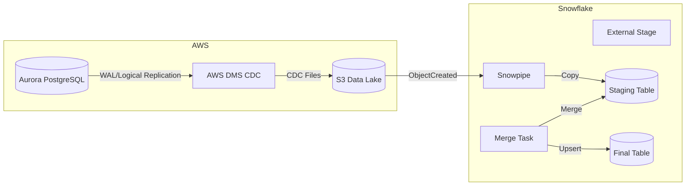

# System Architecture

## Overview
The **Aurora to Snowflake Sync** system is a CDC-driven data pipeline designed to replicate changes from AWS Aurora PostgreSQL v2 to Snowflake. It prioritizes reliability, low source impact, and clear auditability of change events.

## High-Level Diagram

## Data Flow

1.  **Change Capture (DMS)**:
    *   DMS reads WAL changes from Aurora using logical replication.
    *   DMS performs a full load (optional) followed by continuous CDC.
    *   CDC files are written to S3 in Parquet format under `dms/<schema>/<table>/`.
3.  **Staging (S3)**:
    *   DMS writes CDC files directly to the S3 Data Lake bucket.
    *   Path structure: `s3://<bucket>/dms/<schema>/<table>/...`.
4.  **Ingestion (Snowpipe)**:
    *   S3 event notifications trigger Snowpipe.
    *   Snowpipe loads the new files into the corresponding Snowflake CDC staging table.
5.  **Transformation (Snowflake Tasks)**:
    *   Scheduled Snowflake Tasks run periodically (e.g., shortly after the export schedule).
    *   Tasks execute a `MERGE` operation to upsert data from CDC staging to `FINAL` tables, handling deletes, deduplication, and schema alignment.

## Components

### AWS DMS (CDC)
*   **Role**: Streams database changes from Aurora to S3.
*   **Mode**: Full load + CDC.
*   **Output**: Parquet files partitioned by schema and table.

### AWS Aurora PostgreSQL
*   **Replication**: Logical replication enabled for CDC.
*   **Role**: Source system. Emits WAL changes captured by DMS.

### AWS S3
*   **Role**: Intermediate storage / Data Lake.
*   **Lifecycle Policy**: Files can be transitioned to Glacier or expired after ingestion (e.g., 7 days) to save costs.
*   **Guardrails**: Bucket ownership enforcement, public access blocks, and default SSE ensure staging data is not exposed.

### Snowflake
*   **Storage Integration**: Securely connects to S3 without long-lived credentials and uses a dedicated IAM role passed in via Terraform.
*   **Snowpipe**: Provides near-instant ingestion once files land in S3 with one pipe per table/prefix.
*   **Tasks**: Automates SQL-based transformations.

## Security Model
*   **Network**: DMS runs inside private subnets with an S3 VPC endpoint and NAT egress for HTTPS-only traffic.
*   **Secrets**: Aurora credentials are provided to DMS via Terraform variables (or a secret manager integration).
*   **IAM**: Least-privilege roles for DMS (S3 write, Aurora connect) and Snowflake (S3 read).

## Scalability
*   **Export**: DMS scales by replication instance sizing and parallel apply.
*   **Ingestion**: Snowpipe scales automatically with file volume.
*   **Compute**: Snowflake Warehouses can be resized for the Merge tasks if data volume grows.
