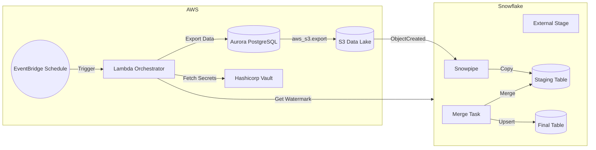

# System Architecture

## Overview
The **Aurora to Snowflake Sync** system is a serverless, batch-oriented data pipeline designed to replicate data from AWS Aurora PostgreSQL v2 to Snowflake Data Lake. It prioritizes cost-efficiency, reliability, and minimal impact on production databases.

## High-Level Diagram

## Data Flow

1.  **Trigger**: AWS EventBridge triggers the `exporter` Lambda function on a configurable schedule (e.g., hourly).
2.  **Orchestration (Lambda)**:
    *   Pulls table sync metadata from AWS Systems Manager Parameter Store so table lists and watermarks are configurable without redeploying the function.
    *   Authenticates with Hashicorp Vault using AWS IAM auth (no long-lived tokens) to retrieve database credentials.
    *   Connects to Snowflake to query the maximum `updated_at` timestamp (watermark) for each configured table.
    *   Connects to Aurora PostgreSQL.
    *   Executes the `aws_s3.query_export_to_s3` function to export records where `updated_at > watermark`.
3.  **Staging (S3)**:
    *   Aurora writes the incremental data as CSV or Parquet files directly to the S3 Data Lake bucket.
    *   Path structure: `s3://<bucket>/<table_name>/YYYY/MM/DD/HH/<uuid>.csv`.
4.  **Ingestion (Snowpipe)**:
    *   S3 event notifications trigger Snowpipe.
    *   Snowpipe loads the new files into the corresponding Snowflake `STAGING` table.
5.  **Transformation (Snowflake Tasks)**:
    *   Scheduled Snowflake Tasks run periodically (e.g., shortly after the export schedule).
    *   Tasks execute a `MERGE` operation to upsert data from `STAGING` to the `FINAL` tables, handling deduplication and schema alignment.

## Components

### AWS Lambda (Orchestrator)
*   **Runtime**: Python 3.9+
*   **Role**: Controller. Does not process data payload itself (to avoid memory/timeout limits).
*   **Key Libraries**: `boto3`, `psycopg2`, `snowflake-connector-python`, `hvac`.

### AWS Aurora PostgreSQL
*   **Extension**: `aws_s3` (Must be enabled).
*   **Role**: Source system. Performs the heavy lifting of writing data to S3.

### AWS S3
*   **Role**: Intermediate storage / Data Lake.
*   **Lifecycle Policy**: Files can be transitioned to Glacier or expired after ingestion (e.g., 7 days) to save costs.
*   **Guardrails**: Bucket ownership enforcement, public access blocks, and default SSE ensure staging data is not exposed.

### Snowflake
*   **Storage Integration**: Securely connects to S3 without long-lived credentials and uses a dedicated IAM role passed in via Terraform.
*   **Snowpipe**: Provides near-instant ingestion once files land in S3 with one pipe per table/prefix.
*   **Tasks**: Automates SQL-based transformations.

## Security Model
*   **Network**: Lambda runs inside private subnets with an S3 VPC endpoint and NAT egress for HTTPS-only traffic.
*   **Secrets**: All credentials stored in Hashicorp Vault. Lambda retrieves them at runtime via IAM auth when possible.
*   **IAM**: Least-privilege roles for Lambda (S3 write, Aurora connect) and Snowflake (S3 read).

## Scalability
*   **Export**: Aurora `aws_s3` export is highly parallelized and efficient.
*   **Ingestion**: Snowpipe scales automatically with file volume.
*   **Compute**: Snowflake Warehouses can be resized for the Merge tasks if data volume grows.
